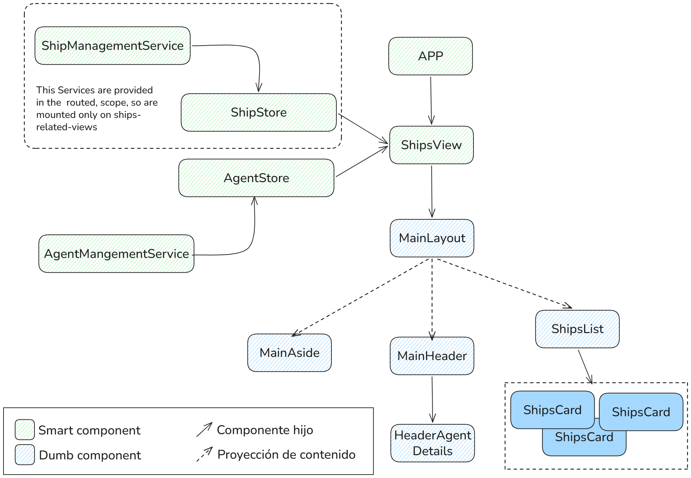
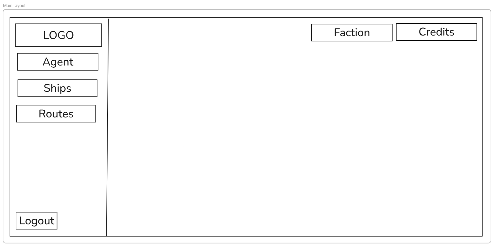

# STATUS RECAP

✅ Completado el requerimiento
☑️ Completado en un 80-90%

La lista completa de requerimientos funcionales del proyecto es la siguiente:

- ✅ FR00 La aplicación debe permitir al usuario entrar mediante su token de Agente
- ☑️ FR01 La aplicación debe permitir al usuario ver estadisticas clave sobre el Agente en sesión
- ✅ FR02 La aplicación debe permitir al usuario ver estadisticas clave sobre la flota del Agente en sesión
- ☑️ FR03 La aplicación debe permitir al usuario configurar rutas comerciales
- ✅ FR04 La aplicación debe permitir al usuario cerrar sesión
- ✅ FR05 La aplicación debe permitir al usuario navegar entre las distintas vistas

**Es importante destacar que NO ES NECESARIO EJECUTAR LAS RUTAS. El scope del proyecto está limitado a leer los datos de los sistemas y markets para permitir configurar rutas.**

La lista completa de requerimientos no funcionales del proyecto es la siguiente:

- ✅ NFR00 La aplicación debe almacenar la información sensible en Session Storage
- ☑️ NFR01 La aplicación debe persistir la información de estadísticas y del configurador de rutas en Local Storage
- ☑️ NFR02 La aplicación debe gestionar las cargas de página de forma controlada, ya sea mediante un loader o skeletons
- ✅ NFR03 La aplicación debe aplicar un timeout de cinco segundos a todas las peticiones HTTP
- ✅ NFR04 La aplicación debe enviar tokens únicamente a aquellos origenes que lo requieran
- ✅ NFR05 La aplicación debe evitar llamadas duplicadas para aquellos recursos que sean considerados estáticos
- NFR06 La aplicación debe gestionar de forma correcta los errores de la SpaceTraders API, informando al usuario de los errores
- ✅ NFR07 La aplicación debe mantenerse usable sin necesidad de hacer recarga de página cuando sucedan errores
- NFR08 Todos los formularios deben dar feedback al usuario sobre el estado de validez de los datos introducidos
- ✅ NFR09 La aplicación debe seguir la arquitectura enseñada durante la University (core, shared, views, etc.)
- ✅ NFR10 La aplicación debe evitar el uso de `any`
- ✅ NFR11 La aplicación debe utilizar `environment` para su configuración
- ✅ NFR12 La aplicación debe asociar todas las configuraciones de rutas y estadísticas al Agente que esté en sesión
- ✅ NFR13 La aplicación debe impedir que se acceda a información que no sea del propio Agente que esté en sesión
- NFR14 La aplicación debe eliminar todos los datos en cada reset de servidor

## Schema for the different views example

## ✅ 5/5 - FR00 La aplicación debe permitir al usuario entrar mediante su token de Agente

Este requerimiento funcional exige que se implemente una vista de login para que el usuario ente a la aplicación.
La lista desglosada de requerimientos es la siguiente:

- ✅ FR00-00 El formulario de login debe requerir únicamente el token de Agente
- ✅ FR00-01 El formulario de login debe validar que se haya introducido un string de tamaño superior a cero (ampliado a 10 para que tenga mas sentido)
- ✅ FR00-02 El formulario de login debe utilizar el endpoint /my/agent para validar el token de Agente introducido
- ✅ FR00-03 El formulario de login debe disparar la validación del token desde un botón de submit
- ✅ FR00-04 Si la validación del token es exitosa, se debe iniciar la sesión en la aplicación y navegar a la vista de resumen de agente.

### Steps

- [x] Crear componente login con un formulario con las validaciones necesarias (sin formBuilder, ya que es solo un campo).
  - [x] Validar que la length es mas de 0.
  - [ ] Validar que el token no esta caducado (es del reset actual).
- [x] Una vez pasadas las validaciones lanzar el endpoint del store que ya tenemos creado que hace la llamada de agentDetails, en caso de que funciona (no da error y tenemos datos):
  - [x] Guardar token en LocalStorage
  - [x] Navegar a la pagina `/ships`
  - [x] Gestionar error si la llamada falla a pesar de que el token fuera aceptable.
- [x] Guards bidireccionales, si no estas logeado no puedes ver nada mas que el login, si estas loggeado, no puedes ver la pagina login.

## 4/5 - FR01 La aplicación debe permitir al usuario ver estadisticas clave sobre el Agente en sesión

Este requerimiento funcional exige que se implemente una vista de resumen de Agente donde se puedan ver ciertas métricas clave e información de interés para el usuario.

La lista desglosada de requerimientos es la siguiente:

- ✅ FR01-00 Se debe mostrar el nombre (callsign) del Agente
- ✅ FR01-01 Se debe mostrar el balance de créditos actual del Agente
- ✅ FR01-02 Se debe mostrar el número de naves pertenecientes a la flota del Agente
- ✅ FR01-03 Se debe mostrar la facción a la que pertenece el Agente
- FR01-04 Se debe mostrar el tiempo de juego restante hasta el próximo reset

### Reference image

### Steps for the header Info

- [x] Retrieve the information from the enpoint `/v2/my/agent`.
- [x] Create the component necessary to show the information needed.
- [x] Manage errors when needed.

### Steps for the aside-menu with agent Info.

- [x] Retrieve the information from the enpoint setted in the [[FR01-Task01]] `/v2/my/agent`.
- [x] Create the component necessary to show the information of Agent, Logo and shipNumber needed.
- [x] Manage errors when needed.

## 4/4 FR02 La aplicación debe permitir al usuario ver estadisticas clave sobre la flota del Agente en sesión

Este requerimiento funcional exige que se implementen varias vistas:

- Vista de resumen de flota
- Vista de detalle de nave

La lista desglosada de requerimientos es la siguiente:

- ✅ FR02-00 Se debe mostrar una lista con la información resumen de todas las naves del agente
    - ✅ Símbolo (nombre) de la nave
    - ✅ Estado de navegación (ORBIT, DOCKED, etc.)
    - ✅ Simbolo del sistema actual
    - ✅ Origen y destino de la navegación actual, si existe
    - Ruta asignada, si existe
- ✅ FR02-01 Se debe navegar a la vista de detalle de nave al hacer click sobre una nave del listado
- ✅ FR02-02 Se deben mostrar los detalles de la nave seleccionada
    - ✅ Mostrar nuevamente toda la información de resumen
    - ✅ Mostrar la configuración de la nave (mounts, cargo, engine, crew, etc.)
    - Mostrar el tiempo de vuelo acumulado
- ✅ FR02-03 Se debe navegar a la vista de detalle de ruta al hacer click sobre la ruta asignada

### Steps for the shipsList view

- [x] Crear View the shipsList
- [x] Crear servicio con la llamada de la API y store (el store guardara la info de las naves app-wide, mientras que el servicio gestionara las funciones para las llamadas http). Ambos NO seran provided in root, ya que el scope será solo ships
  - [x] Servicio
  - [x] Store
- [x] Maquetar la pagina de shipsList
  - [x] Shipcard
  - [x] Structure (ShipcardList)
- [x] Preparar eventclick para que pueda navegar ShipsView
- [x] Navegar a `ships/:id`

### Steps for the shipsList view

- [x] Obtener la info con un resolver, en caso de que sea buena, mostrart detalles, y sino gestionar el error, no hace falta llamar a la api, ya que la info del endpoint `/ships/:ship` no añade informacion adicional a la que tenemos ya en el store de ships
- [x] Mostrar la info mencionada en el enunciado: ![[Pasted image 20260602100019.png]]

## 4/9 FR03 La aplicación debe permitir al usuario configurar rutas comerciales

Este requerimiento funcional exige que se implementen varias vistas:

- Resumen de rutas configuradas
- Detalle y configurador de ruta

La idea es separar la ejecución de las rutas de su configuración. En este requerimiento funcional solo se va a implementar la parte de configuración de las rutas.

La lista desglosada de requerimientos es la siguiente:

- ☑️ FR03-00 Se debe mostrar en un listado todas las rutas configuradas por el usuario
    - ✅ Se debe mostrar el nombre de la ruta
    - Se debe mostrar la fecha de creación de la ruta
    - Se debe mostrar la fecha de la última actualización de la ruta
- ✅ FR03-01 Se debe navegar a la vista de detalle de ruta al hacer click sobre una ruta
- FR03-02 El usuario debe poder eliminar una ruta desde la vista de resumen
- ✅ FR03-03 En la vista de detalle de ruta se debe mostrar la configuración actual de la ruta con todos sus pasos
- ☑️ FR03-04 En la vista de detalle de ruta se debe permitir al usuario editar la configuración de la ruta
    - ✅ Se debe permitir al usuario configurar múltiples paradas en la ruta
    - ✅ Las rutas deben contener al menos una paradas
    - ✅ Se debe permitir al usuario configurar múltiples acciones de comercio en cada parada
    - ✅ Las paradas pueden no tener acciones de comercio
    - Se debe permitir al usuario decidir que clase de navegación realizar (Jump vs navegación normal)
    - Se debe asistir al usuario recomendando tipos de navegación disponible
    - Sólo se debería mostrar la navegación tipo Jump en caso de ser una parada de tipo Jump Gate
    - ✅ Se debe asistir al usuario recomendando destinos disponibles a la hora de configurar las navegaciones
    - ✅ Sólo deben mostrarse Waypoints que contengan un Market o Waypoints que sean Jump Gates
    - ✅ Se debe asistir al usuario recomendando acciones posibles de comercio (mostrar solo productos disponibles, mostrar si el producto esta categorizado como Import-Export-Exchange, etc.)
- FR03-05 El usuario debe poder eliminar la ruta entera desde la vista de detalle de ruta
- FR03-06 El usuario debe poder eliminar uno o más pasos de la ruta
- FR03-07 Se debe garantizar la validez de la ruta al momento de guardarla
- ✅ FR03-08 Se debe asumir que las rutas empiezan desde el sistema donde el agente tiene sus headquarters (HQ)
- ✅ FR03-09 Se debe garantizar el acceso a las rutas configuradas incluso después de cerrar el navegador

#### Detalle y configurador de rutas

Ya que hay muchos requerimientos a continuación os dejo en formato prosa la idea general de la vista de detalle de ruta.

La idea es tener una vista que nos permita alternar entre un modo de lectura y un modo de edición.

En el modo lectura no permitiremos al usuario hacer ninguna acción sobre la ruta comercial. Es posible que interese cambiar la forma en que se renderiza la ruta, probablemente en modo lectura podamos mostrar la ruta de forma compacta.

En el modo de edición el usuario deberá ser capaz de modificar los pasos y acciones que forman la ruta. Se debe confirmar que todo lo que se configura realmente existe, tanto los Waypoints y su forma de navegar a ellos como los productos a comprar en los distintos Markets.

El foco de esta feature son rutas comerciales, por lo que los Waypoints a mostrar deberían ser solamente aquellos con el trait `Marketplace` o Waypoints cuyo type sea `JUMP_GATE`. Esto es por que queremos que los usuarios puedan ir a Markets para comerciar y que puedan ir a Jump Gates para saltar entre sistemas.

Para no complicar mucho el configurador, vamos a asumir que los Waypoints a mostrar están acotados al sistema donde el Agente tenga su HQ. Si se toma una acción de salto a otro sistema entonces tendremos que empezar a recomendar Waypoints del sistema al que se haya saltado. Es posible que nos interese mostrar claramente en que sistema se llevan a cabo los distintos pasos de la ruta en todo momento.

### 3/3 FR04 La aplicación debe permitir al usuario cerrar sesión

Este requerimiento exige que se implemente algún mecanismo para permitir al usuario hacer logout.

La lista desglosada de requerimientos es la siguiente:

- ✅ FR04-00 Se debe ofrecer al usuario una manera de hacer logout del Agente en sesión
- ✅ FR04-01 Al hacer logout se debe enviar al usuario a la página de login
- ✅ FR04-02 Al hacer logout se debe limpiar la información del Agente vinculada a la sesión

### ✅ 1/1 FR05 La aplicación debe permitir al usuario navegar entre las distintas vistas

Este requerimiento exige que se implemente un componente de navegación para permitir al usuario navegar entre las distintas vistas.

- ✅ FR05-00 Se debe ofrecer al usuario una manera de navegar entre las distintas vistas resumen
    - Existen las siguientes vistas a tener en cuenta: resumen de agente, resumen de flota, resumen de rutas

## Deuda técnica

- [ ] Mucha complejidad en componente `login`
- [ ] Gestionde error en el component del nombre del agente (`agentSymbol`)
- [ ] Gestion de errores en el formulario insuficiente
- [ ] No se ha implementado el tipo de navegacion segun si es normal o jump
- [ ] No se muestran las fechas de creacion y edicion de las rutas
- [ ] No se ha implementado la eliminacion de rutas

## Nice addons si hay tiempo

- [ ] Ahora mismo los datos son estaticos, ya que las rutas no se ejecutan, pero de vez en cuando una rellamadita a la API para actualizar el estado de las naves estaria bien.
- [ ] comprobar mejor los validators del token:
  - [ ] Comprobar maximo y minimo que pueden tener y hacer esta validacion mejor que poner 10 por poner algo.
  - [ ] Comprobar que el token es del reset actual, para no aceptar tokens caducados, antes de hacer la peticion a la API.
- [ ] Loading en el login, para dar mas feedback y evitar que el usuario pueda estar dandole varias veces al boton de submit.
- [ ] Persistir mas informacion en localStorage.
- [ ] Implentar un skelleton en la pagina de shipsList mientras se cargan los datos.
- [ ] Separar en componentes un poco mas pequeños la vista de detalles de la nave, ya que es un componente gigante.
- [ ] Tener un iconito con el numero de rutas del agente tipo como la que hay en el numero de naves en el aside menu.
